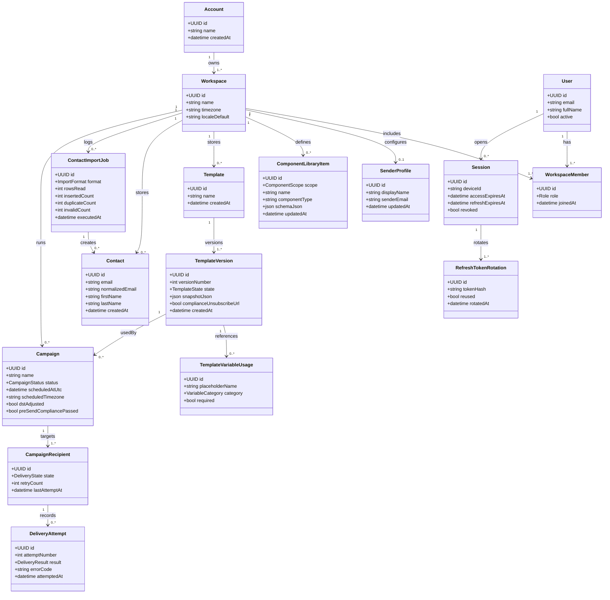

# Domain Class Diagram

This class model describes the conceptual domain entities and key relationships that support SendIO business behavior. It emphasizes workspace scoping, access control, campaign lifecycle, and delivery observability.

## Notes

- `WorkspaceMember.role` is constrained to `Owner`, `Editor`, or `Viewer`.
- `CampaignRecipient.state` is constrained to `pending`, `sent`, or `failed` with retry limit enforcement.
- `RefreshTokenRotation.reused = true` signals token reuse detection and session revocation.
- `TemplateVersion` is immutable; each edit creates a new version.
- Variable placeholders follow `{{variable_name}}`, and missing values render as empty string.
- Sender profile in MVP uses format validation only; ownership verification is out of current scope.
