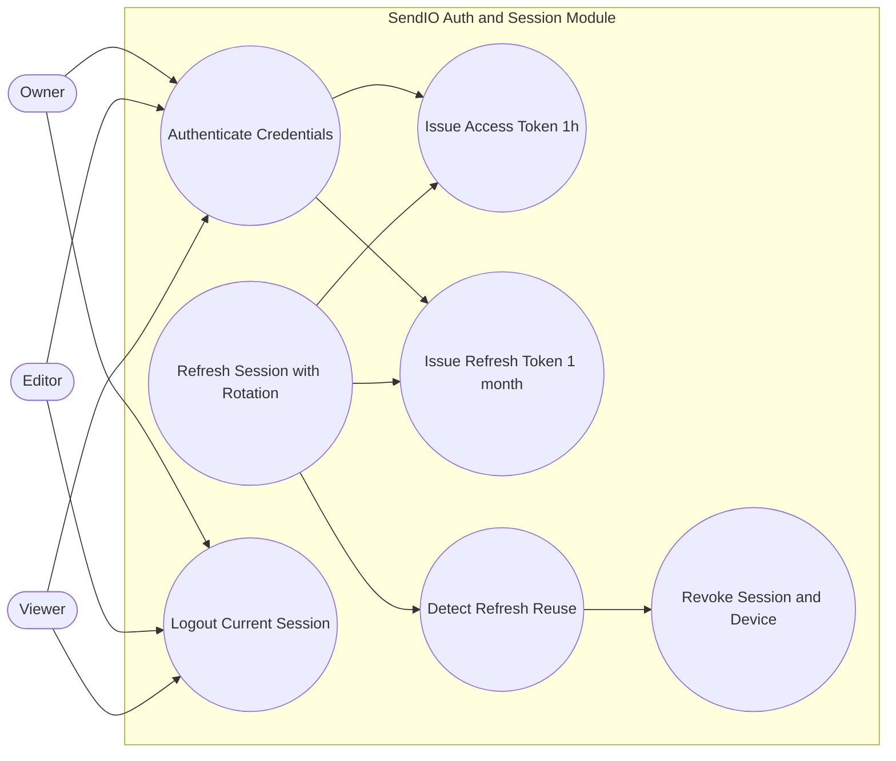

# Auth and Session Use Cases

This diagram defines role-independent authentication and session control behaviors, emphasizing JWT issuance, refresh rotation, and defensive revocation when refresh reuse is detected.

- Access tokens are short-lived (1 hour) and are re-issued through successful refresh.
- Refresh tokens live for 1 month and are rotated on every refresh operation.
- Reuse detection on a rotated refresh token triggers immediate session and device revocation.
- Session controls apply uniformly to Owner, Editor, and Viewer.
