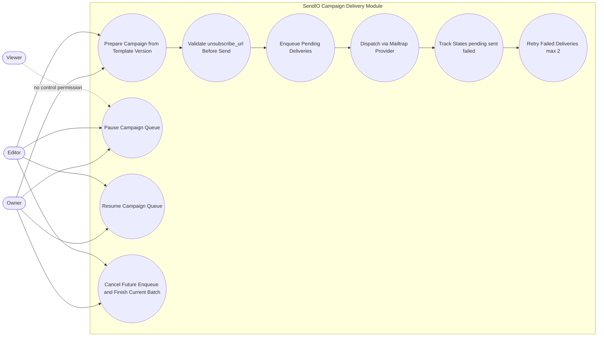

# Campaign Delivery Use Cases

This diagram defines campaign execution and control behaviors across pre-send checks, queuing, dispatch, retry policy, and operator controls.

- Campaign execution is blocked unless `unsubscribe_url` is present at pre-send.
- Delivery starts in `pending`, transitions to `sent` or `failed`, and allows up to two retries (maximum three total attempts including the first send).
- Pause and resume operate on pending queue items only.
- Cancel prevents future enqueue and lets the active batch complete safely.
