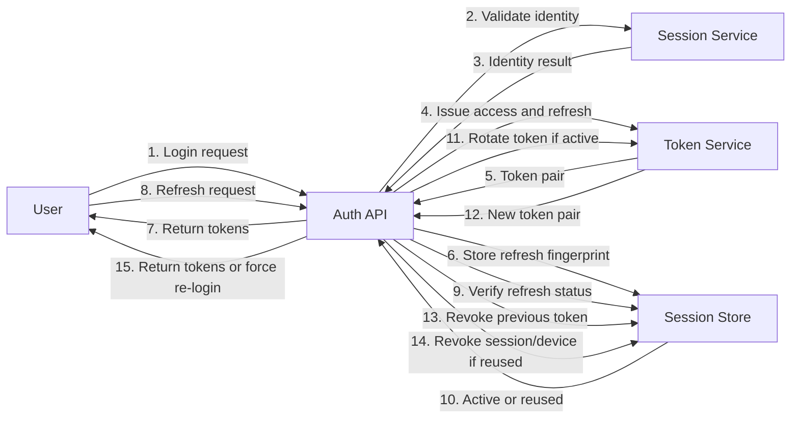

# Communication: Auth Refresh Reuse Collaboration

This collaboration diagram details refresh-token rotation interaction and the defensive branch that revokes sessions when token reuse is detected.

- Rotation and revocation are persisted through refresh fingerprint tracking.
- Access lifetime remains 1 hour and refresh lifetime remains 1 month.
- Reuse branch revokes session and device context to contain compromise.
- Collaboration path is role-agnostic for authenticated users.
