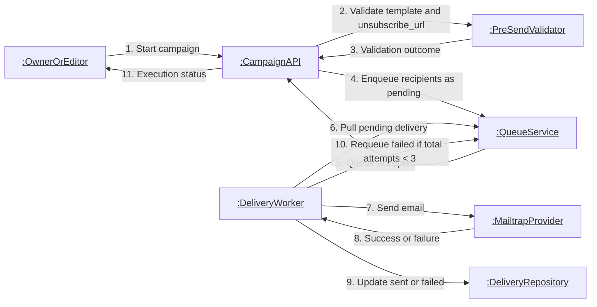

# Communication: Campaign Delivery Collaboration

This collaboration diagram captures message-level coordination for campaign pre-send checks, queue-driven dispatch, provider feedback, and bounded retries.

- Delivery collaboration starts only after pre-send checks pass.
- Mailtrap is the sole provider endpoint in MVP flow.
- Failed deliveries can return to queue while total attempts remain below 3 (initial attempt + 2 retries).
- State repository is the source of truth for pending/sent/failed progression.
