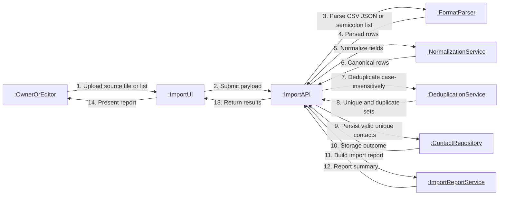

# Communication: Contact Import Collaboration

This collaboration diagram shows message ordering for multi-format contact import, normalization, deduplication, persistence, and reporting.

- Collaboration covers the full ingestion path from parsing to operator-visible report.
- Invalid rows are skipped and recorded without aborting accepted rows.
- Deduplication operates in case-insensitive mode by design.
- The report provides operational traceability for accepted, duplicate, and invalid records.
