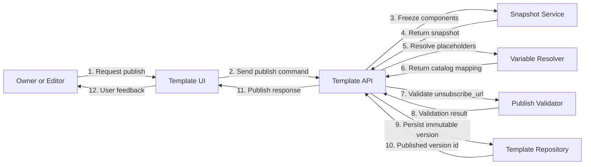

# Communication: Template Publish Collaboration

This collaboration diagram expresses the ordered message exchange for template publication with mandatory unsubscribe validation and immutable snapshot persistence.

- Message ordering enforces validation before repository persistence.
- Catalog resolution step anchors variable semantics to Contact, Workspace, and System sources.
- Missing variable values are handled at render time as empty string.
- Publish is rejected whenever `unsubscribe_url` validation fails.
