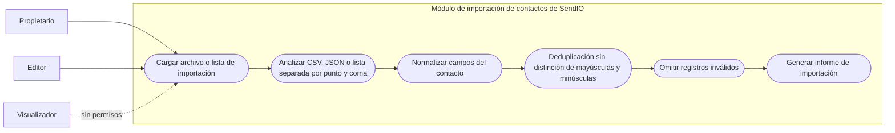

# Casos de uso de importación de contactos

Este diagrama modela el comportamiento de ingesta de contactos para los formatos admitidos y las reglas obligatorias de normalización, deduplicación y reporte de registros inválidos.

- Las formas de entrada admitidas son CSV, JSON y cargas de listas delimitadas por punto y coma.
- La normalización se aplica antes de la deduplicación para reducir discrepancias de forma canónica.
- La deduplicación no distingue mayúsculas y minúsculas y preserva una única identidad canónica del contacto.
- Las filas inválidas se omiten y se exponen en un informe explícito de importación.
