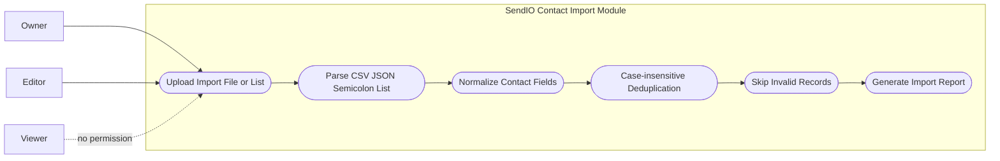

# Contact Import Use Cases

This diagram models contact ingestion behavior for supported formats and the mandatory normalization, deduplication, and invalid-record reporting rules.

- Supported input shapes are CSV, JSON, and semicolon-delimited list payloads.
- Normalization is applied before deduplication to reduce canonical-form mismatches.
- Deduplication is case-insensitive, preserving a single canonical contact identity.
- Invalid rows are skipped and surfaced in an explicit import report.
