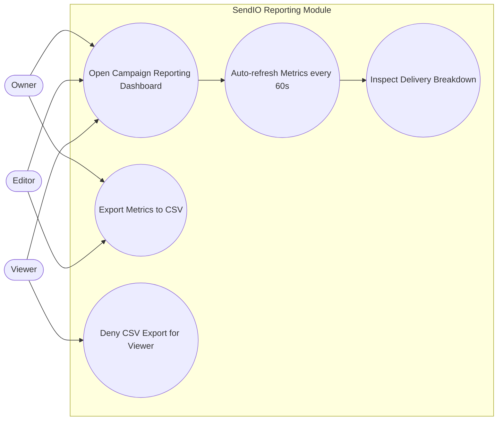

# Reporting Use Cases

This diagram specifies reporting interactions, including periodic dashboard refresh and role-based export restrictions.

- Reporting dashboards are available to all roles for read access.
- Data refresh cadence is fixed at 60 seconds.
- CSV export is restricted to Owner and Editor roles.
- Viewer export attempts are explicitly denied by authorization policy.
