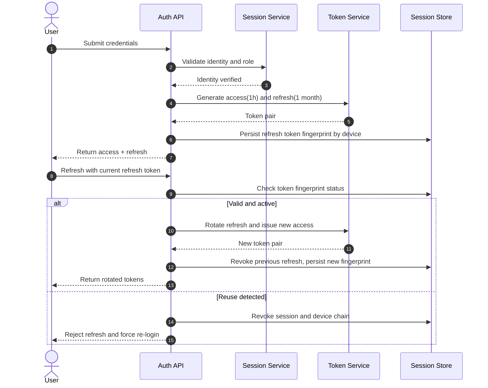

# Sequence: Authentication, Refresh, and Rotation

This sequence defines the secure token lifecycle from login to rotated refresh handling, including defensive revocation on refresh token reuse.

- Access token lifetime is fixed to 1 hour.
- Refresh token lifetime is fixed to 1 month.
- Every refresh rotates token material and revokes predecessor token.
- Reuse of a rotated refresh token triggers immediate revocation of the session/device.
