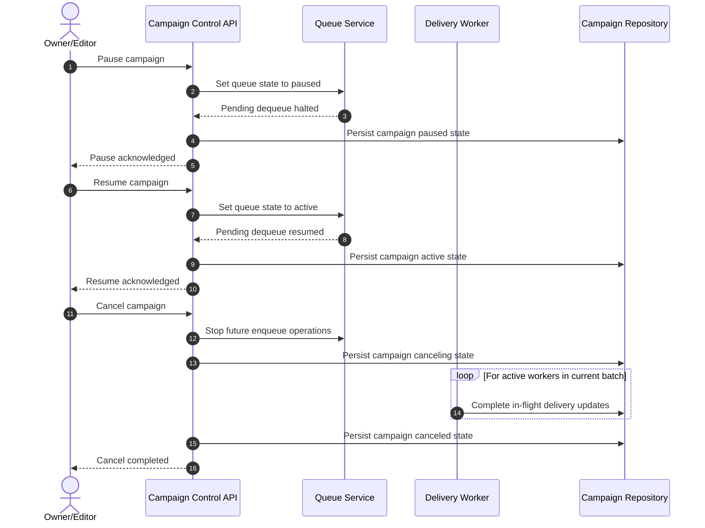

# Sequence: Campaign Control (Pause, Resume, Cancel)

This sequence documents operational controls that affect queue progression while preserving in-flight batch consistency.

- Pause impacts only pending queue consumption, not completed records.
- Resume restarts consumption from remaining pending deliveries.
- Cancel blocks all future enqueue operations.
- Current in-flight batch is allowed to finish before terminal cancel state.
