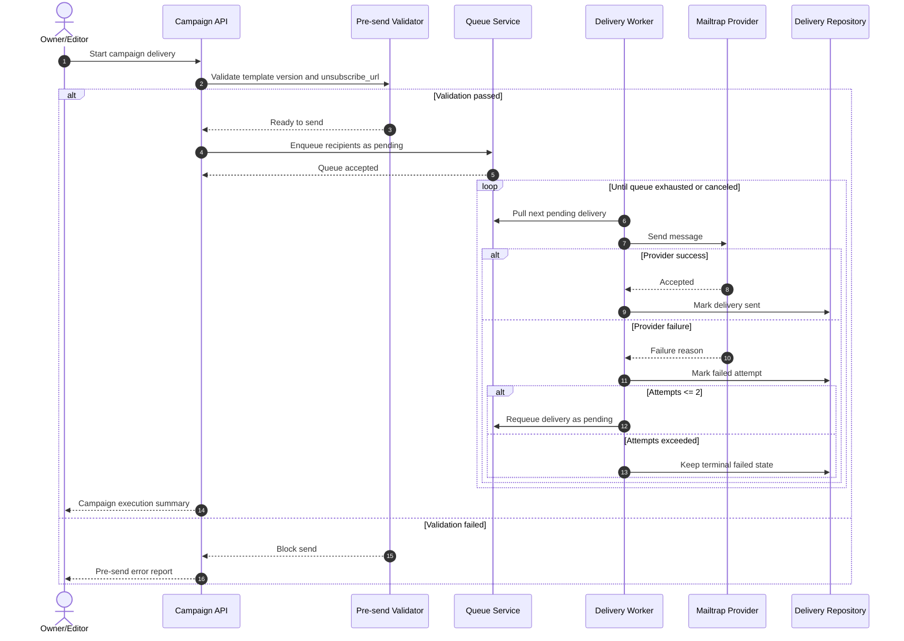

# Sequence: Campaign Pre-send and Delivery

This sequence defines campaign execution from pre-send validation through queued dispatch and bounded retry handling with Mailtrap as the MVP provider.

- Campaign cannot start without a valid `unsubscribe_url`.
- Initial delivery status is `pending`, then `sent` or `failed`.
- Retry policy is capped at two retries per failed recipient (up to three total attempts including initial send).
- Mailtrap is the single configured provider in the MVP baseline.
