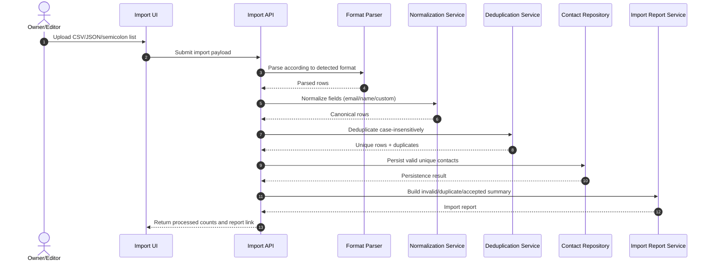

# Sequence: Contact Import Processing

This sequence formalizes input ingestion across supported formats and the processing pipeline for normalization, deduplication, and invalid-record reporting.

- Parser accepts CSV, JSON, and semicolon-delimited list structures.
- Normalization precedes deduplication to ensure canonical comparison.
- Deduplication is case-insensitive for identity keys such as email.
- Invalid rows are skipped, not blocking valid row ingestion.
- Import report includes accepted, duplicate, and invalid breakdown.
