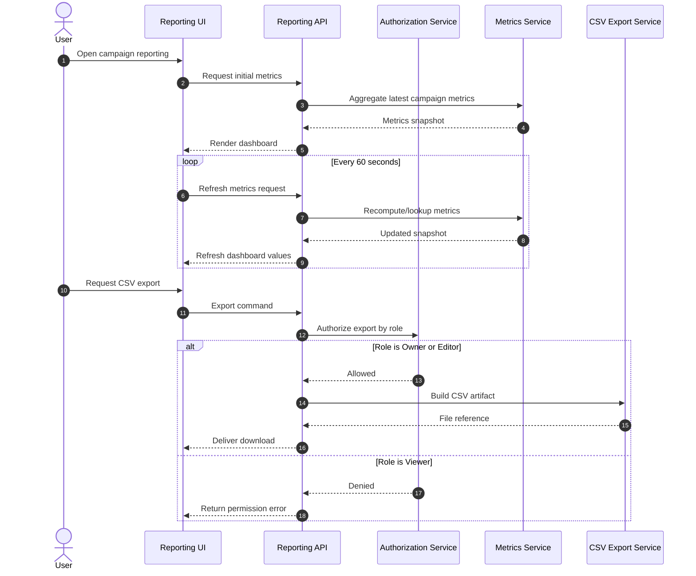

# Sequence: Reporting Refresh and Export

This sequence models reporting reads with periodic refresh and role-aware CSV export authorization.

- Dashboard refresh interval is fixed to 60 seconds.
- Export path always checks role authorization before generating files.
- Viewer role can view metrics but cannot export CSV.
- Owner and Editor can export full reporting snapshots.
