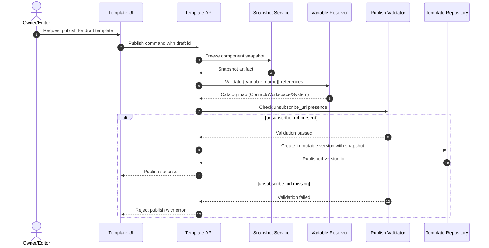

# Sequence: Template Publish Validation

This sequence describes the publish-time validation path for templates, preserving immutable versioning, component snapshots, variable rules, and unsubscribe enforcement.

- Publish operation snapshots components and stores an immutable version.
- Variable placeholders must follow `{{variable_name}}` and resolve against supported catalogs.
- Missing runtime variable values are rendered as empty string in delivery context.
- `unsubscribe_url` is mandatory and publish is rejected if absent.
