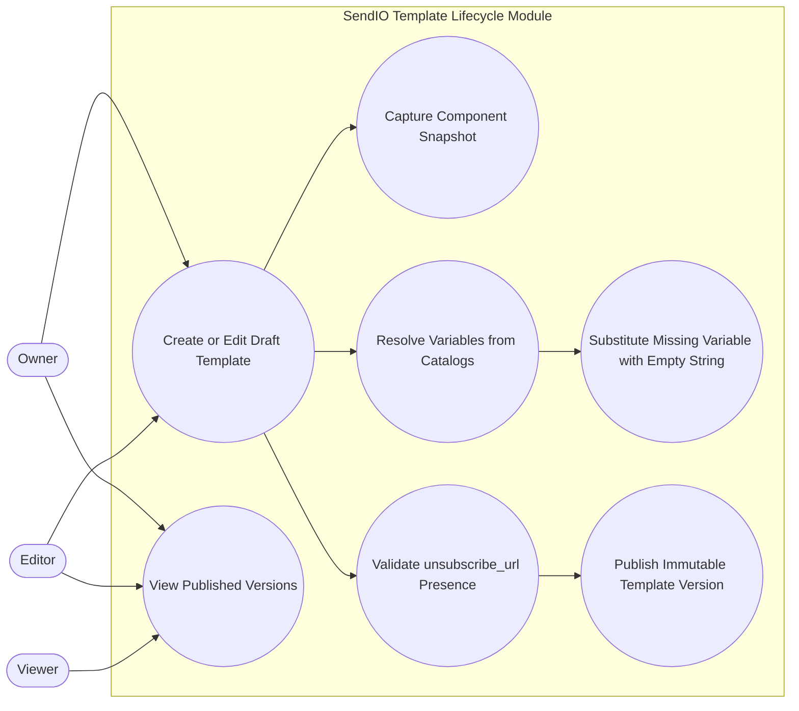

# Template Lifecycle Use Cases

This diagram captures template authoring and publish controls, including immutable versioning, component snapshots, variable catalog resolution, and unsubscribe enforcement.

- Published versions are immutable and keep their exact component snapshot.
- Variable placeholders use `{{variable_name}}` and map to Contact, Workspace, and System catalogs.
- Missing variable values are replaced with empty string to keep rendering deterministic.
- `unsubscribe_url` is mandatory at publish time and blocks publication if missing.
