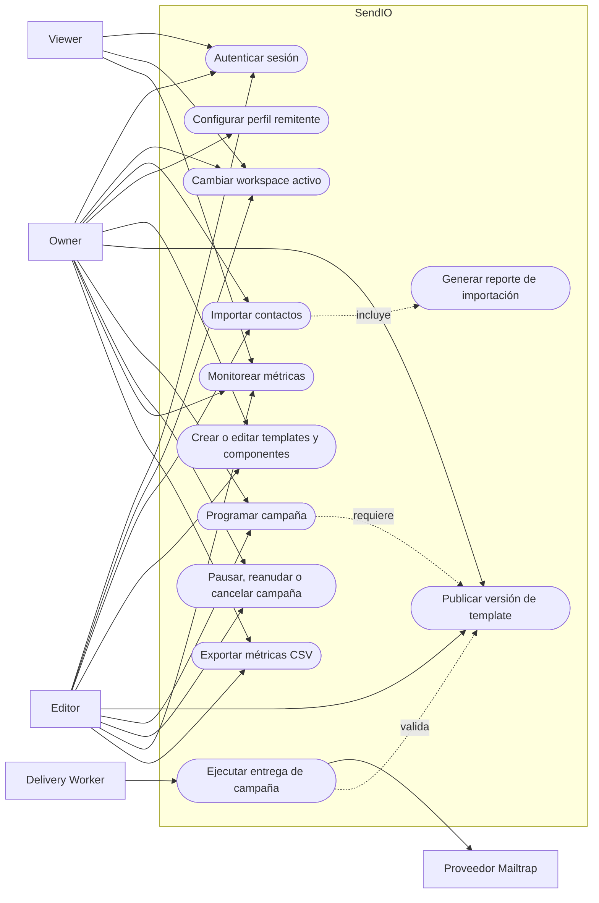
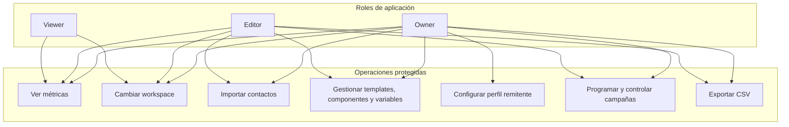
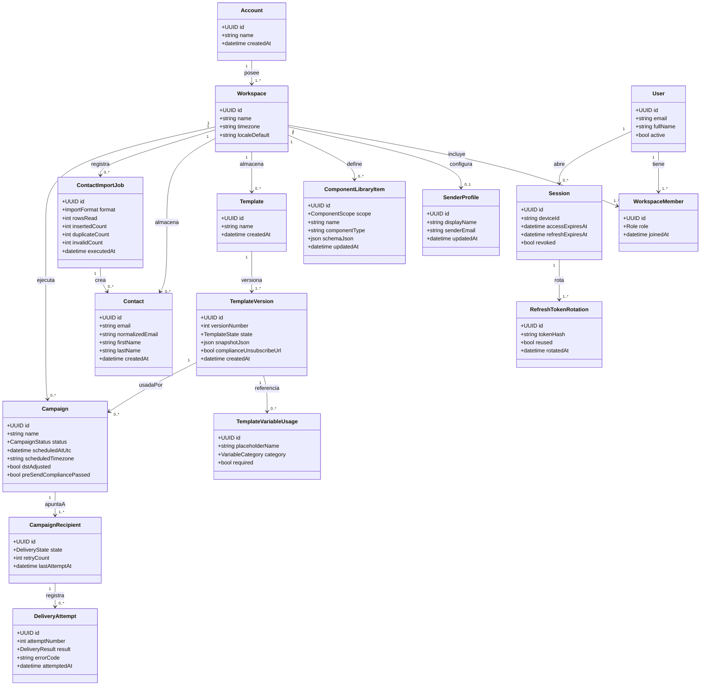

# Modelo de análisis del sistema SendIO

Este documento consolida, en español, los actores, casos de uso, modelo de dominio, diagrama de clases y reglas de negocio principales de SendIO. Su alcance se limita a los artefactos de análisis y requisitos existentes para evitar decisiones nuevas no validadas.

## Alcance funcional

| Área | Alcance documentado |
|---|---|
| Producto | Plataforma para construir emails con editor visual drag-and-drop, gestionar contactos, ejecutar campañas masivas y consultar resultados. |
| Modelo organizacional | Modelo cuenta-workspace: una cuenta posee workspaces y los usuarios operan recursos dentro de un workspace activo. |
| Roles | Owner, Editor y Viewer, con permisos diferenciados por operación. |
| Idiomas prioritarios | Inglés (`en`) y español (`es`). |
| Entrega MVP | Envío mediante Mailtrap sandbox para desarrollo, validación y demo. |
| Seguridad | Autenticación con JWT, refresh token con rotación y control de reutilización. |

## Actores del sistema y de la aplicación

| Actor | Tipo | Responsabilidad principal | Alcance de permisos |
|---|---|---|---|
| Owner | Humano / aplicación | Administrar el workspace, el perfil remitente, templates, contactos, campañas y reportes. | Acceso completo dentro del workspace, incluida configuración de remitente. |
| Editor | Humano / aplicación | Crear contenido operativo: contactos, templates, componentes, campañas y reportes exportables. | Puede operar campañas y contenido, pero no administrar el perfil remitente. |
| Viewer | Humano / aplicación | Consultar métricas operativas del workspace. | Solo lectura de reporting; no importa contactos ni exporta CSV. |
| Delivery Worker | Sistema | Ejecutar la entrega de campañas programadas, aplicar compliance, reintentos y estados por destinatario. | Opera sobre colas y destinatarios elegibles dentro del workspace. |
| Proveedor Mailtrap | Sistema externo | Recibir los mensajes salientes del entorno sandbox. | Usado para MVP/demo; no representa proveedor productivo definitivo. |

## Casos de uso principales

| ID | Caso de uso | Actores | Resultado esperado |
|---|---|---|---|
| UC-01 | Autenticar sesión y rotar tokens | Owner, Editor, Viewer | Sesión segura con access token de 1 hora, refresh token de 1 mes y rotación controlada. |
| UC-02 | Cambiar workspace activo | Owner, Editor, Viewer | Los recursos visibles y operables quedan filtrados al workspace seleccionado. |
| UC-03 | Importar contactos | Owner, Editor | Contactos válidos guardados, duplicados/inválidos omitidos y reporte de importación generado. |
| UC-04 | Configurar perfil remitente | Owner | Perfil remitente único y efectivo para el workspace. |
| UC-05 | Crear o editar templates y componentes | Owner, Editor | Borradores de templates, componentes reutilizables y variables válidas disponibles para publicar. |
| UC-06 | Publicar versión de template | Owner, Editor | Versión inmutable publicada si cumple schema, variables y `unsubscribe_url`. |
| UC-07 | Programar campaña | Owner, Editor | Campaña programada usando timezone del workspace y timestamp UTC persistido. |
| UC-08 | Ejecutar entrega de campaña | Delivery Worker | Destinatarios procesados con estados `pending`, `sent` o `failed` y hasta 2 reintentos. |
| UC-09 | Pausar, reanudar o cancelar campaña | Owner, Editor | Control predecible del procesamiento sin romper batches en vuelo. |
| UC-10 | Monitorear métricas | Owner, Editor, Viewer | Dashboard operativo actualizado cada 60 segundos. |
| UC-11 | Exportar métricas CSV | Owner, Editor | CSV scopeado al workspace; Viewer queda excluido. |

## Diagrama de casos de uso

## Diagrama de permisos por rol

## Modelo de dominio

El dominio se organiza alrededor del workspace. Cada recurso operativo debe resolverse dentro de ese límite para evitar fugas entre espacios de trabajo.

| Entidad | Descripción | Relaciones clave |
|---|---|---|
| Account | Agrupa uno o más workspaces. | Posee workspaces. |
| Workspace | Límite operativo de colaboración, recursos, timezone y locale. | Contiene miembros, contactos, templates, campañas, perfil remitente y reportes. |
| User | Persona que accede a la aplicación. | Tiene membresías en workspaces y sesiones. |
| WorkspaceMember | Vincula usuario, workspace y rol. | Determina permisos Owner, Editor o Viewer. |
| SenderProfile | Identidad remitente efectiva del workspace. | Máximo un perfil activo por workspace. |
| Contact | Destinatario importado y normalizado. | Pertenece a un workspace y puede participar en campañas. |
| ContactImportJob | Registro del procesamiento de una importación. | Contabiliza leídos, insertados, duplicados e inválidos. |
| ComponentLibraryItem | Componente reutilizable del editor visual. | Pertenece al workspace y puede insertarse como snapshot en templates. |
| Template | Contenedor logico del diseno de email. | Tiene versiones publicables. |
| TemplateVersion | Snapshot inmutable de un template publicado. | Referencia variables y puede usarse por campañas. |
| TemplateVariableUsage | Uso declarado de placeholders. | Restringido a categorias Contact, Workspace y System. |
| Campaign | Orquesta envío masivo, programación, estado y compliance pre-send. | Usa una versión de template y genera destinatarios. |
| CampaignRecipient | Estado de entrega por contacto objetivo. | Registra intentos y reintentos. |
| DeliveryAttempt | Evidencia de cada intento de envío. | Registra resultado, error y fecha. |
| Session | Sesión autenticada por dispositivo. | Tiene expiración y estado de revocación. |
| RefreshTokenRotation | Historial de rotación de refresh tokens. | Detecta reutilización y dispara revocación de sesión. |

## Diagrama de clases de dominio

## Catálogo de reglas de negocio

| ID | Regla |
|---|---|
| RN-01 | La reutilización de un refresh token debe revocar la sesión o dispositivo activo. |
| RN-02 | El scope del token debe respetar workspace y rol. |
| RN-03 | No se permite fuga de datos entre workspaces. |
| RN-04 | La deteccion de contactos duplicados debe ser case-insensitive. |
| RN-05 | Registros inválidos o duplicados no deben bloquear registros válidos del mismo lote de importación. |
| RN-06 | Solo Owner puede configurar el perfil remitente del workspace. |
| RN-07 | Debe existir como máximo un perfil remitente efectivo por workspace. |
| RN-08 | En MVP, el perfil remitente valida formato; la verificación de propiedad queda diferida. |
| RN-09 | El schema del template debe validarse al guardar y al publicar. |
| RN-10 | Todo template publicado debe incluir `unsubscribe_url`. |
| RN-11 | Una version publicada de template es inmutable; editarla crea una nueva version. |
| RN-12 | Los placeholders deben usar `{{variable_name}}`. |
| RN-13 | Las categorias permitidas de variables son Contact, Workspace y System. |
| RN-14 | Variables válidas sin valor deben renderizar como cadena vacía y no bloquear el envío. |
| RN-15 | Las inserciones de componentes en templates deben guardarse como snapshots inmutables por version. |
| RN-16 | La programación de campañas debe usar timezone del workspace y persistir el instante en UTC. |
| RN-17 | Horarios locales inválidos por DST deben moverse al siguiente instante válido con aviso explícito al usuario. |
| RN-18 | La ejecución de campañas debe realizar compliance pre-send antes de procesar la cola. |
| RN-19 | Los estados de destinatario de campaña son `pending`, `sent` y `failed`. |
| RN-20 | Cada destinatario puede reintentarse como maximo 2 veces, para un total de 3 intentos incluyendo el inicial. |
| RN-21 | Pausar una campaña detiene nuevos dequeues desde la cola pendiente. |
| RN-22 | Reanudar una campaña reactiva los dequeues pendientes. |
| RN-23 | Cancelar una campaña bloquea futuros envíos, pero no interrumpe el batch actualmente en procesamiento. |
| RN-24 | Owner, Editor y Viewer pueden ver métricas del workspace. |
| RN-25 | Solo Owner y Editor pueden exportar métricas a CSV. |
| RN-26 | El dashboard de reporting debe refrescar métricas cada 60 segundos. |
| RN-27 | Las etiquetas visibles de reporting y experiencia MVP deben soportar `en` y `es`. |
| RN-28 | Los endpoints con alcance de workspace deben exigir contexto de workspace y membresia valida. |
| RN-29 | La UI no sustituye la autorizacion backend; los permisos deben validarse server-side. |
| RN-30 | Logs y auditoría no deben incluir PII cruda, cuerpos de email, tokens, passwords ni secretos. |

## Brechas conocidas

| ID | Brecha | Impacto |
|---|---|---|
| B-01 | El análisis general menciona importación CSV, JSON y lista separada por punto y coma, pero el contrato backend MVP prioriza CSV. | Debe existir una tarea explícita si JSON/lista entran en MVP. |
| B-02 | El wizard frontend requiere registro del primer usuario propietario, mientras el contrato backend documentado cubre login y bootstrap autenticado. | Onboarding end-to-end necesita cerrar esta capacidad. |
| B-03 | Mailtrap está documentado para sandbox MVP/demo, no para producción. | Antes de producción se requiere proveedor real y políticas de dominio/remitente. |

## Fuentes

- [Use Case Diagram](use-case-diagram.md)
- [Use Case Specifications](use-case-specifications.md)
- [Domain Class Diagram](domain-class-diagram.md)
- [Project Requirements](project-requirements.md)
