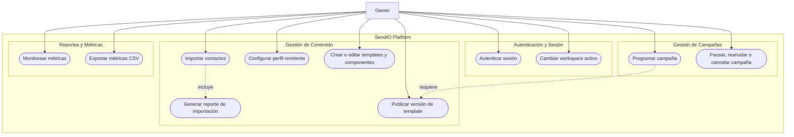
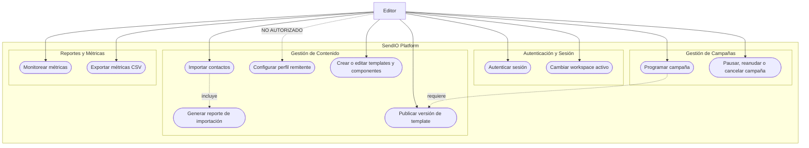
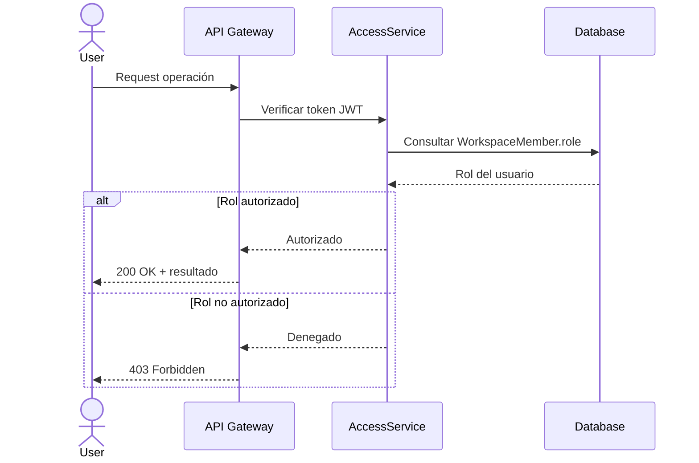

# Diagramas de Uso por Rol — Owner, Editor y Viewer

Este documento desglosa los diagramas de caso de uso de SendIO según los tres roles de aplicación: **Owner**, **Editor** y **Viewer**. Cada diagrama muestra las interacciones específicas que cada rol puede realizar dentro del sistema, junto con las restricciones y dependencias que aplican.

## Resumen de Roles

| Rol | Responsabilidad Principal | Alcance de Permisos |
|-----|---------------------------|---------------------|
| **Owner** | Administrar el workspace completo, incluyendo configuración de remitente, templates, contactos, campañas y reportes. | Acceso total dentro del workspace. Único rol que puede configurar el perfil remitente. |
| **Editor** | Crear y gestionar contenido operativo: contactos, templates, componentes, campañas y exportaciones. | Puede operar campañas y contenido, pero **no** administrar el perfil remitente. |
| **Viewer** | Consultar métricas operativas del workspace. | Solo lectura de reporting; no importa contactos, no exporta CSV, no gestiona campañas. |

---

## 1. Diagrama de Uso del Rol Owner

El **Owner** tiene acceso completo a todas las funcionalidades del workspace. Es el único rol que puede configurar el perfil remitente.

### Casos de Uso del Owner

| ID | Caso de Uso | Descripción |
|----|-------------|-------------|
| UC-01 | Autenticar sesión | Establece sesión segura con JWT (1h) y refresh token (1 mes) con rotación. |
| UC-02 | Cambiar workspace | Filtra recursos al workspace seleccionado. Sin acceso cross-workspace. |
| UC-03 | Importar contactos | Ingesta desde CSV/JSON con normalización, deduplicación y validación. |
| UC-04 | Configurar perfil remitente | **Exclusivo del Owner.** Define el remitente único del workspace. |
| UC-05 | Crear/editar templates | Gestiona borradores, componentes reutilizables y variables válidas. |
| UC-06 | Publicar template | Publica versión inmutable si cumple schema y `unsubscribe_url`. |
| UC-07 | Programar campaña | Agenda usando timezone del workspace con persistencia UTC. |
| UC-09 | Pausar/reanudar/cancelar | Control de campaña sin interrumpir batches en vuelo. |
| UC-10 | Monitorear métricas | Dashboard operativo actualizado cada 60 segundos. |
| UC-11 | Exportar CSV | Genera CSV scopeado al workspace. |

---

## 2. Diagrama de Uso del Rol Editor

El **Editor** puede realizar todas las operaciones de contenido y campañas, pero **no** puede configurar el perfil remitente (exclusivo del Owner).

### Casos de Uso del Editor

| ID | Caso de Uso | Descripción | Restricción vs Owner |
|----|-------------|-------------|----------------------|
| UC-01 | Autenticar sesión | Misma seguridad y rotación de tokens que Owner. | — |
| UC-02 | Cambiar workspace | Mismo comportamiento que Owner. | — |
| UC-03 | Importar contactos | Misma funcionalidad de normalización y validación. | — |
| UC-04 | Configurar perfil remitente | **NO AUTORIZADO.** Retorno 403. | Solo Owner |
| UC-05 | Crear/editar templates | Misma funcionalidad. | — |
| UC-06 | Publicar template | Misma validación de compliance. | — |
| UC-07 | Programar campaña | Misma funcionalidad con timezone. | — |
| UC-09 | Pausar/reanudar/cancelar | Mismo control de campañas. | — |
| UC-10 | Monitorear métricas | Mismo dashboard operativo. | — |
| UC-11 | Exportar CSV | Misma funcionalidad de exportación. | — |

---

## 3. Diagrama de Uso del Rol Viewer

El **Viewer** tiene acceso de solo lectura. Puede autenticarse, cambiar workspace y monitorear métricas, pero **no** puede importar contactos, gestionar contenido, controlar campañas ni exportar datos.

```mermaid
flowchart TB
    viewer[Viewer]

    subgraph sendio[SendIO Platform]
        direction TB

        subgraph auth[Autenticación y Sesión]
            ucAuth([Autenticar sesión])
            ucWorkspace([Cambiar workspace activo])
        end

        subgraph content[Gestión de Contenido]
            ucImport([Importar contactos])
            ucSender([Configurar perfil remitente])
            ucTemplate([Crear o editar templates y componentes])
            ucPublish([Publicar versión de template])
        end

        subgraph campaigns[Gestión de Campañas]
            ucSchedule([Programar campaña])
            ucControl([Pausar, reanudar o cancelar campaña])
        end

        subgraph reporting[Reportes y Métricas]
            ucMetrics([Monitorear métricas])
            ucExport([Exportar métricas CSV])
        end
    end

    viewer --> ucAuth
    viewer --> ucWorkspace
    viewer --> ucMetrics

    viewer -.->|NO AUTORIZADO| ucImport
    viewer -.->|NO AUTORIZADO| ucSender
    viewer -.->|NO AUTORIZADO| ucTemplate
    viewer -.->|NO AUTORIZADO| ucPublish
    viewer -.->|NO AUTORIZADO| ucSchedule
    viewer -.->|NO AUTORIZADO| ucControl
    viewer -.->|NO AUTORIZADO| ucExport
```

### Casos de Uso del Viewer

| ID | Caso de Uso | Descripción | Restricción |
|----|-------------|-------------|-------------|
| UC-01 | Autenticar sesión | Misma seguridad y rotación de tokens. | — |
| UC-02 | Cambiar workspace | Mismo comportamiento. | — |
| UC-10 | Monitorear métricas | Dashboard de solo lectura, actualización cada 60s. | — |
| UC-03 | Importar contactos | **NO AUTORIZADO.** | Solo Owner/Editor |
| UC-04 | Configurar perfil remitente | **NO AUTORIZADO.** | Solo Owner |
| UC-05 | Crear/editar templates | **NO AUTORIZADO.** | Solo Owner/Editor |
| UC-06 | Publicar template | **NO AUTORIZADO.** | Solo Owner/Editor |
| UC-07 | Programar campaña | **NO AUTORIZADO.** | Solo Owner/Editor |
| UC-09 | Pausar/reanudar/cancelar | **NO AUTORIZADO.** | Solo Owner/Editor |
| UC-11 | Exportar CSV | **NO AUTORIZADO.** | Solo Owner/Editor |

---

## 4. Diagrama Comparativo de Permisos

Este diagrama muestra de forma consolidada qué operaciones puede realizar cada rol.

```mermaid
flowchart TB
    subgraph roles[Roles de Aplicación]
        owner[Owner]
        editor[Editor]
        viewer[Viewer]
    end

    subgraph operaciones[Operaciones Protegidas]
        direction TB

        subgraph all[Acceso Universal]
            auth[Autenticar sesión]
            workspace[Cambiar workspace]
            metrics[Monitorear métricas]
        end

        subgraph content_ops[Gestión de Contenido]
            import[Importar contactos]
            sender[Configurar perfil remitente]
            templates[Gestionar templates y componentes]
            publish[Publicar versión de template]
        end

        subgraph campaign_ops[Gestión de Campañas]
            schedule[Programar campaña]
            control[Pausar/reanudar/cancelar]
        end

        subgraph export_ops[Exportación]
            csv[Exportar CSV]
        end
    end

    owner --> auth
    owner --> workspace
    owner --> metrics
    owner --> import
    owner --> sender
    owner --> templates
    owner --> publish
    owner --> schedule
    owner --> control
    owner --> csv

    editor --> auth
    editor --> workspace
    editor --> metrics
    editor --> import
    editor --> templates
    editor --> publish
    editor --> schedule
    editor --> control
    editor --> csv

    viewer --> auth
    viewer --> workspace
    viewer --> metrics
```

---

## 5. Reglas de Negocio por Rol

| Regla | Descripción | Roles Afectados |
|-------|-------------|-----------------|
| BR-01 | Refresh token reuse revoca sesión/dispositivo actual. | Todos |
| BR-02 | Scope de token es workspace-aware y restringido por rol. | Todos |
| BR-03 | No se permite filtrado de datos cross-workspace. | Todos |
| BR-06 | Exactamente un perfil remitente activo por workspace. | Owner |
| BR-06b | Validación de remitente es solo formato (MVP). | Owner |
| BR-06d | `unsubscribe_url` es obligatorio para publicar template. | Owner, Editor |
| BR-07 | Horario DST inválido se ajusta al siguiente instante válido. | Owner, Editor |
| BR-10 | Cancelar no interrumpe batch en procesamiento. | Owner, Editor |
| BR-11 | Viewer puede leer métricas pero no exportar CSV. | Viewer |
| BR-12 | Localización de reporting soporta `en` y `es`. | Todos |

---

## 6. Secuencia de Autorización por Rol

Cuando un actor intenta una operación, el sistema verifica su rol antes de proceder:

---

## 7. Matriz de Decisión Rápida

| Operación | Owner | Editor | Viewer |
|-----------|:-----:|:------:|:------:|
| Autenticar sesión | ✅ | ✅ | ✅ |
| Cambiar workspace | ✅ | ✅ | ✅ |
| Monitorear métricas | ✅ | ✅ | ✅ |
| Importar contactos | ✅ | ✅ | ❌ |
| Configurar perfil remitente | ✅ | ❌ | ❌ |
| Crear/editar templates | ✅ | ✅ | ❌ |
| Publicar versión de template | ✅ | ✅ | ❌ |
| Programar campaña | ✅ | ✅ | ❌ |
| Pausar/reanudar/cancelar campaña | ✅ | ✅ | ❌ |
| Exportar métricas CSV | ✅ | ✅ | ❌ |

---

## Referencias

- [Especificaciones de Casos de Uso](use-case-specifications.md)
- [Diagrama de Casos de Uso General](use-case-diagram.md)
- [Modelo de Análisis del Sistema](modelo-analisis-sistema.md)
- [Diagrama de Relaciones de Entidad](../design/entity-relationship-diagram.md)
