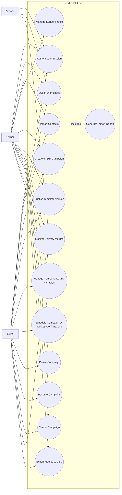

# Use Case Diagram

This diagram represents the main interactions between platform actors and the SendIO system boundary. It captures authorization constraints, campaign operations, and reporting responsibilities under the current requirements baseline.

## Notes

- `Manage Sender Profile` is reserved to `Owner` as an explicit governance rule.
- `Export Metrics to CSV` is available to `Owner` and `Editor`, but not `Viewer`.
- `Import Contacts` includes normalization and validation behavior defined in the use-case specifications.
- `Publish Template Version` includes schema validation and mandatory `unsubscribe_url` compliance checks.
