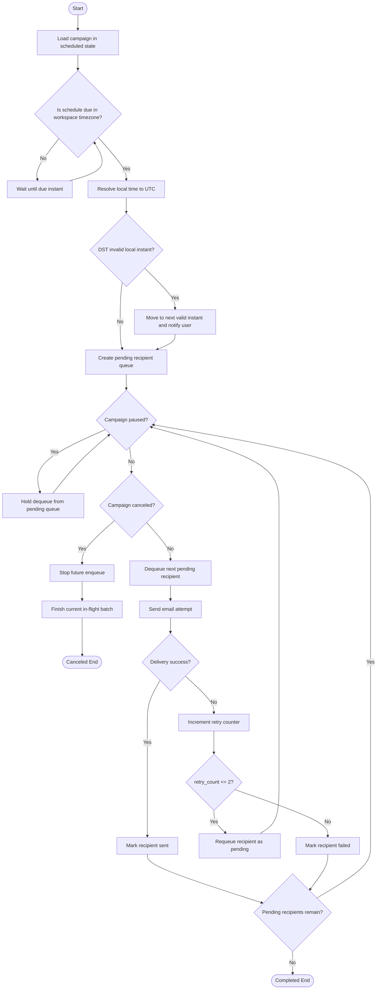

# Activity Diagram - Campaign Delivery Lifecycle

This activity diagram formalizes campaign execution behavior including schedule resolution, queue control, retry logic, and terminal states.

## Design Notes

- Cancel semantics intentionally preserve consistency by allowing in-flight batch completion.
- Pause/resume controls affect only pending dequeue operations.
- Retry policy caps additional attempts at 2 per recipient before terminal failure.
