# Component Diagram

This diagram describes the high-level software decomposition for SendIO. It emphasizes separation between presentation, application orchestration, domain policies, and infrastructure services.

```mermaid
flowchart TB
    subgraph Client[Web Client]
      UIAuth["«component»<br/>Auth Module"]
      UIWorkspace["«component»<br/>Workspace Context Module"]
      UIContacts["«component»<br/>Contact Import Module"]
      UICampaign["«component»<br/>Campaign Builder and Controls"]
      UIReports["«component»<br/>Reporting Dashboard"]
      UILocale["«component»<br/>i18n Layer (en/es)"]
    end

    subgraph API[Application API]
      AuthAPI["«component»<br/>Auth and Session Controller"]
      WorkspaceAPI["«component»<br/>Workspace Access Controller"]
      ContactAPI["«component»<br/>Contact Import Controller"]
      TemplateAPI["«component»<br/>Template and Component Controller"]
      CampaignAPI["«component»<br/>Campaign Lifecycle Controller"]
      ReportAPI["«component»<br/>Reporting Controller"]
    end

    subgraph Core[Domain and Application Services]
      AuthService["«component»<br/>Token and Session Service"]
      AccessService["«component»<br/>Role Authorization Service"]
      ContactService["«component»<br/>Import Normalization Service"]
      TemplateService["«component»<br/>Template Versioning Service"]
      ValidationService["«component»<br/>Schema and Compliance Validation Service"]
      CampaignService["«component»<br/>Campaign Scheduling Service"]
      QueueService["«component»<br/>Queue Orchestration Service"]
      DeliveryService["«component»<br/>Delivery Execution Service"]
      ReportingService["«component»<br/>Metrics Aggregation Service"]
    end

    subgraph Workers[Background Workers]
      QueueWorker["«process»<br/>Laravel Redis Queue Worker"]
    end

    subgraph Infra[Infrastructure]
      DB[("«database»<br/>Relational Database")]
      Queue[("«queue»<br/>Redis Queue")]
      Mailtrap["«service»<br/>Mailtrap Email Sandbox API"]
      Cache[("«cache»<br/>Cache")]
      FileStorage[("«storage»<br/>Object Storage for Reports")]
    end

    UIAuth --> AuthAPI
    UIWorkspace --> WorkspaceAPI
    UIContacts --> ContactAPI
    UICampaign --> TemplateAPI
    UICampaign --> CampaignAPI
    UIReports --> ReportAPI
    UILocale --> UIAuth
    UILocale --> UIWorkspace
    UILocale --> UIContacts
    UILocale --> UICampaign
    UILocale --> UIReports

    AuthAPI --> AuthService
    WorkspaceAPI --> AccessService
    ContactAPI --> ContactService
    ContactAPI --> AccessService
    TemplateAPI --> TemplateService
    TemplateAPI --> ValidationService
    TemplateAPI --> AccessService
    CampaignAPI --> CampaignService
    CampaignAPI --> ValidationService
    CampaignAPI --> QueueService
    CampaignAPI --> AccessService
    ReportAPI --> ReportingService
    ReportAPI --> AccessService

    AuthService --> DB
    ContactService --> DB
    ContactService --> FileStorage
    TemplateService --> DB
    ValidationService --> DB
    CampaignService --> DB
    CampaignService --> Queue
    QueueService --> Queue
    QueueWorker --> Queue
    QueueWorker --> DeliveryService
    DeliveryService --> Mailtrap
    DeliveryService --> DB
    ReportingService --> DB
    ReportingService --> Cache
```

## Design Notes

- Authorization is centralized in `AccessService` to enforce role boundaries consistently.
- CSV export output is produced through reporting and persisted via object storage for controlled access.
- Delivery behavior is intentionally queue-centric to support pause/resume/cancel semantics safely.
- `queue-worker` is a Docker-managed Laravel process that consumes Redis queue jobs and invokes delivery execution outside the browser request path.
- MVP delivery provider is **Mailtrap** (sandbox/demo focus). Production provider abstraction is deferred as future evolution.
- `ValidationService` enforces template schema validation on save/publish and mandatory `unsubscribe_url` compliance on publish and pre-send.
