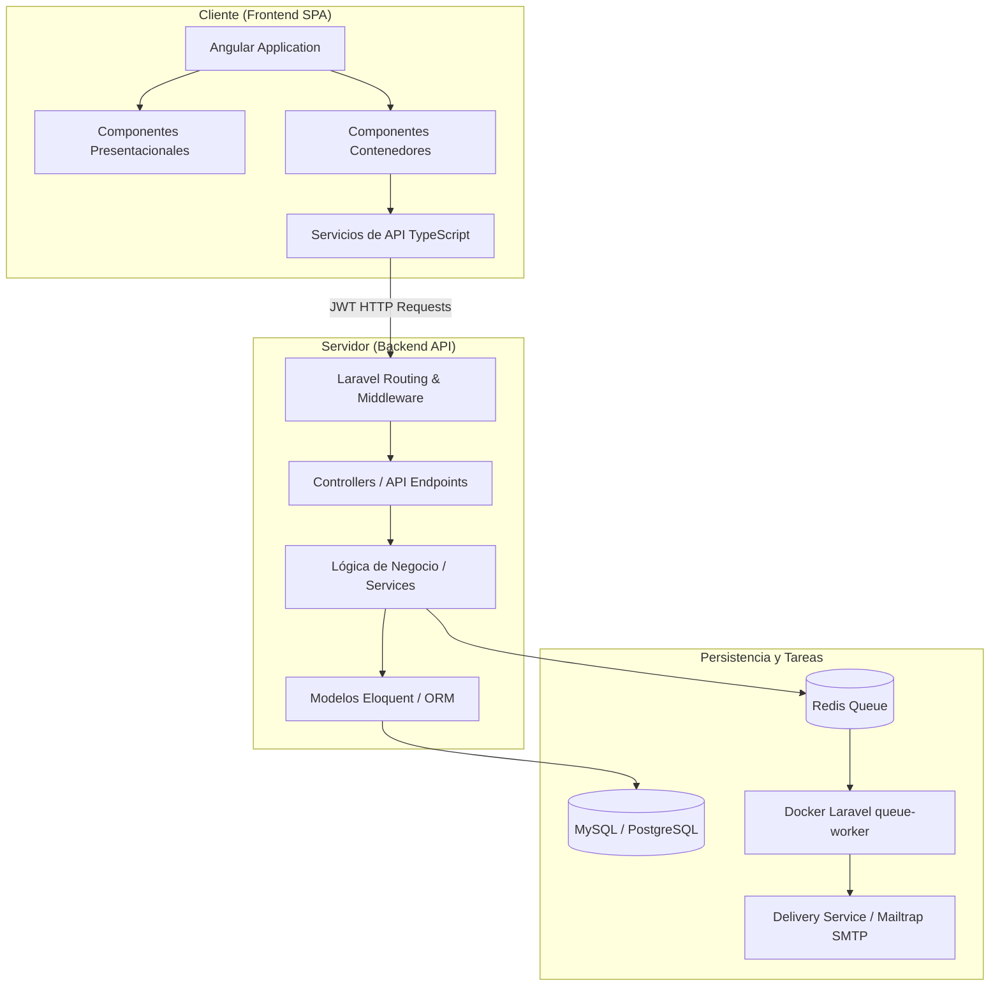
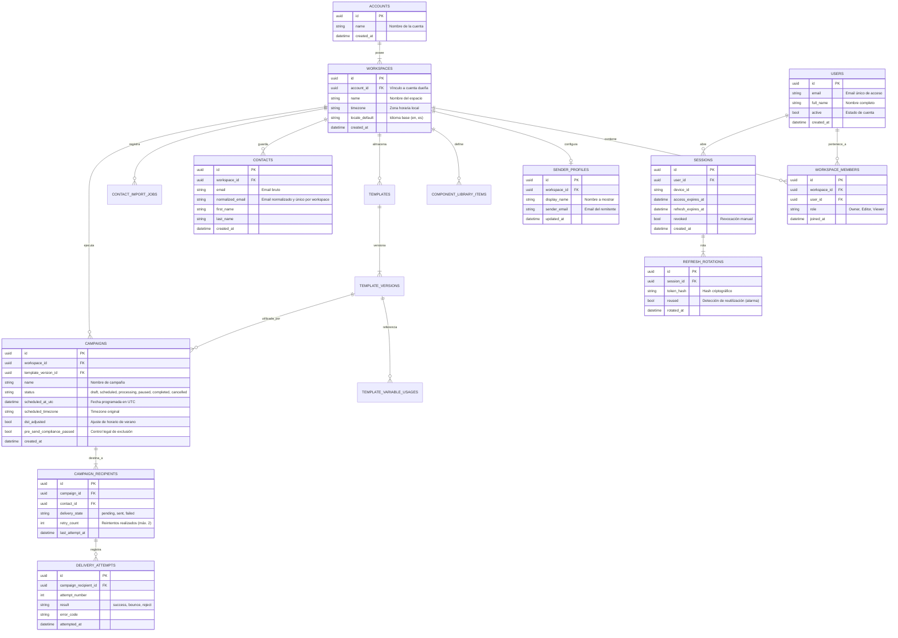
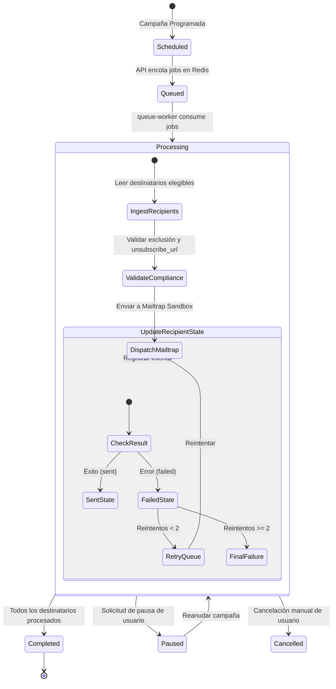

# Capítulo: Diseño del Sistema (SendIO)

Este documento detalla el diseño arquitectónico, el modelo de datos y el flujo de comportamiento de SendIO. Se ha estructurado bajo las directrices y estándares formales requeridos en la memoria de un Trabajo Fin de Grado (TFG) de ingeniería informática.

---

## 1. Arquitectura de Software del Sistema

El sistema SendIO se descompone bajo un patrón de **Cliente-Servidor desacoplado** utilizando las siguientes especificaciones:



### 1.1 Patrón de Diseño en el Frontend: Container-Presentational
En la aplicación frontend (Angular), la interfaz de usuario se implementa separando la lógica del estado de la representación visual:
* **Componentes Presentacionales (Dumb Components)**: Se encargan exclusivamente de la representación visual y estilos. Reciben datos a través de entradas (`@Input`) y notifican eventos de usuario a través de salidas (`@Output`). No conocen la API ni el estado global.
* **Componentes Contenedores (Smart Components)**: Manejan el estado, se conectan a los servicios de Angular e interactúan con la API de backend. Alimentan de datos a los componentes presentacionales y capturan sus eventos.

### 1.2 Estructura Arquitectónica del Backend: Enfoque Modular
El backend (Laravel) adopta una arquitectura basada en capas limpias que separan la infraestructura de la regla de negocio:
1. **Capa de Controladores e Infraestructura**: Maneja las peticiones HTTP externas, valida las cabeceras JWT y la autenticación mediante middleware de rotación de tokens.
2. **Capa de Lógica de Negocio**: Clases de servicio independientes encargadas del procesamiento de payloads, importación de contactos y encolado de campañas.
3. **Capa de Persistencia (ORM)**: Modelos de Laravel Eloquent con aislamiento de Workspace. Todo recurso está vinculado a un identificador de workspace (`workspace_id`), asegurando que ningún usuario acceda a datos ajenos.
4. **Capa de Tareas en Segundo Plano**: Un proceso Docker `queue-worker` ejecuta `php artisan queue:work redis --sleep=1 --tries=3 --timeout=120` para consumir jobs desde Redis y realizar el envío efectivo de correos fuera del ciclo HTTP del navegador.

---

## 2. Diseño de Datos y Persistencia

### 2.1 Justificación del Modelo Cuenta-Workspace
SendIO utiliza un modelo organizativo similar a plataformas como Notion o Slack:
* **Cuentas**: Representan la entidad jurídica o de facturación global.
* **Workspaces (Espacios de Trabajo)**: Áreas de colaboración aisladas donde se guardan contactos, plantillas, perfiles de remitente y campañas.
* **Miembros de Workspace**: Usuarios asociados a un Workspace específico con un rol determinado (`Owner`, `Editor`, `Viewer`).

Este diseño proporciona **seguridad lógica** completa, ya que las consultas a la base de datos se filtran automáticamente por el workspace activo en la sesión del usuario.

### 2.2 Justificación de Identificadores UUID (Universally Unique Identifier)
En lugar de IDs autoincrementales tradicionales (enteros de 32/64 bits), SendIO implementa **UUID v4** en todas sus tablas primarias.
* **Trade-offs y Beneficios**:
  * **Seguridad**: Evita la enumeración de recursos. Un atacante no puede adivinar una URL cambiando un ID correlativo (p. ej., `campaigns/1` a `campaigns/2`).
  * **Desacoplamiento**: Permite generar IDs únicos en el frontend o en servicios distribuidos antes de persistirlos en la base de datos.
  * **Escalabilidad**: Facilita la migración de bases de datos o fusiones de particiones sin colisión de claves.
* **Mitigación de Cons**: Se utilizan tipos de datos específicos de base de datos (`uuid` en PostgreSQL o binarios optimizados en MySQL) para mitigar la penalización de rendimiento de indexación de cadenas de texto largas.

### 2.3 Diagrama Entidad-Relación (DER)
El esquema lógico de la base de datos modela la jerarquía organizativa, la persistencia de contactos normales y el motor de auditoría de seguridad:



---

## 3. Flujos de Comportamiento Clave

### 3.1 Ciclo de Envío de Campañas (Diagrama de Actividad)
El motor de ejecución de campañas procesa el envío de correos masivos a través de colas Redis en segundo plano. La API acepta y encola el trabajo; el proceso Docker `queue-worker` consume los jobs y ejecuta los envíos, protegiendo al servidor contra sobrecargas y gestionando reintentos automáticos.



### 3.2 Rotación Criptográfica de Refresh Tokens (Detección de Reutilización)
Para proteger las sesiones de los usuarios, SendIO implementa un mecanismo de rotación criptográfica estricta:
1. El cliente envía un **Refresh Token** para obtener un nuevo **Access Token**.
2. El servidor valida el Refresh Token contra el registro histórico `REFRESH_ROTATIONS`.
3. Si el Refresh Token ya ha sido utilizado previamente, el servidor asume que ha habido un robo de credenciales.
4. **Respuesta de seguridad inmediata**: Se invalidan inmediatamente todas las sesiones activas asociadas a ese usuario, forzando un cierre de sesión global y registrando la alerta en el trail de auditoría.

---

## 4. Diseño del Flujo de Interfaz (Navegación SPA)

La interfaz se estructura como una SPA organizada por módulos autocontenidos:

```
[Login / Registro]
       │
       ▼
[Onboarding de Workspace] ──(Crear o seleccionar Workspace)
       │
       ▼
[Dashboard Principal (Layout Base con Selector de Workspace)]
       ├── [Sección Contactos] ──> Importación (CSV/JSON)
       ├── [Sección Plantillas] ──> Editor Drag-and-Drop (Maquetación)
       ├── [Sección Campañas] ──> Programador & Monitor en Tiempo Real
       └── [Configuración] ──> Perfil Remitente & Control de Miembros
```

Este diseño asegura que el usuario siempre opere bajo el contexto de un **workspace activo**, refrescando la interfaz reactivamente cada vez que el selector superior cambia el workspace de trabajo.
