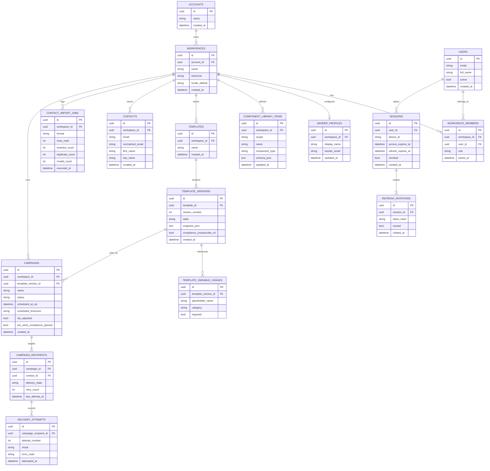

# Entity Relationship Diagram

This ERD translates the domain model into a relational perspective suitable for persistence design. It preserves workspace isolation, role assignment, campaign processing, and reporting traceability.

## Design Notes

- `WORKSPACE_MEMBERS.role` must be constrained to `Owner`, `Editor`, or `Viewer`.
- `CONTACTS.normalized_email` supports case-insensitive deduplication.
- `CAMPAIGN_RECIPIENTS.retry_count` enforces retry maximum of 2.
- `REFRESH_ROTATIONS.reused` is the audit trigger for forced session revocation.
- `TEMPLATE_VERSIONS` are immutable snapshots; campaigns reference a fixed version.
- `TEMPLATE_VARIABLE_USAGES.placeholder_name` follows `{{variable_name}}` semantics and allowed categories: Contact, Workspace, System.
- Missing variable values render as empty string at compile time.
- Sender email is format-validated only in MVP (ownership verification deferred).
