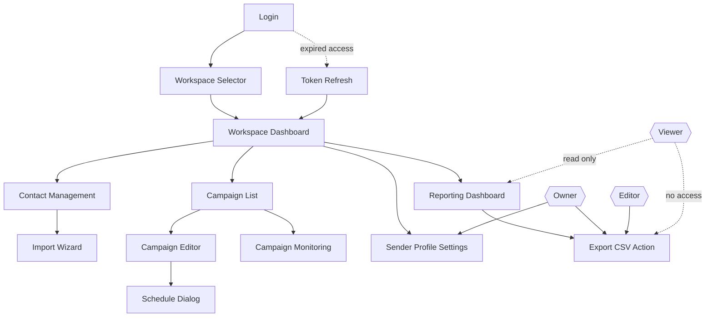

# Navigation Diagram

This diagram documents the primary application navigation and role-conditioned routes. It makes role permissions explicit to reduce ambiguity in UX and authorization behavior.

## Design Notes

- Workspace selection is a first-class step because all resources are workspace-scoped.
- `Sender Profile Settings` is reachable only for `Owner`.
- `Export CSV Action` is explicitly denied for `Viewer` while preserving reporting visibility.
