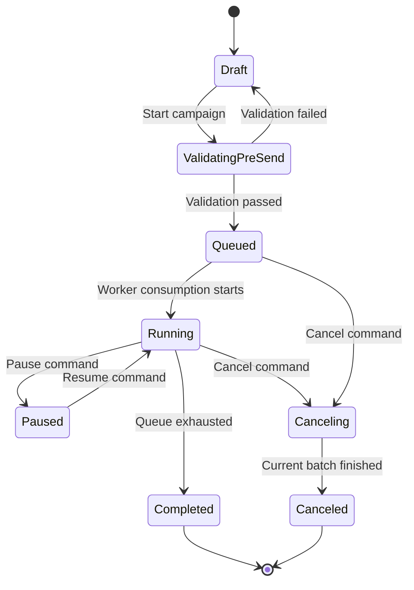

# State: Campaign Lifecycle

This state machine models campaign orchestration from draft preparation to terminal completion or cancellation under queue-control constraints.

- Pre-send validation includes mandatory `unsubscribe_url` verification.
- Pause and resume act on queue progression, preserving accumulated delivery history.
- Cancel transitions to an intermediate `Canceling` state to finish in-flight work safely.
- Campaign reaches `Completed` only after queue exhaustion with no pending recipients.
