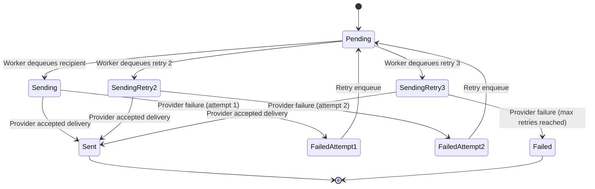

# State: Delivery Recipient Lifecycle

This state machine specifies recipient-level delivery transitions, including retry bounds and terminal outcomes.

- Initial state is always `Pending` before dispatch.
- Maximum retries are two after initial failure, leading to a final third send attempt.
- Successful provider acceptance yields terminal `Sent`.
- Exceeding retry budget yields terminal `Failed`.
